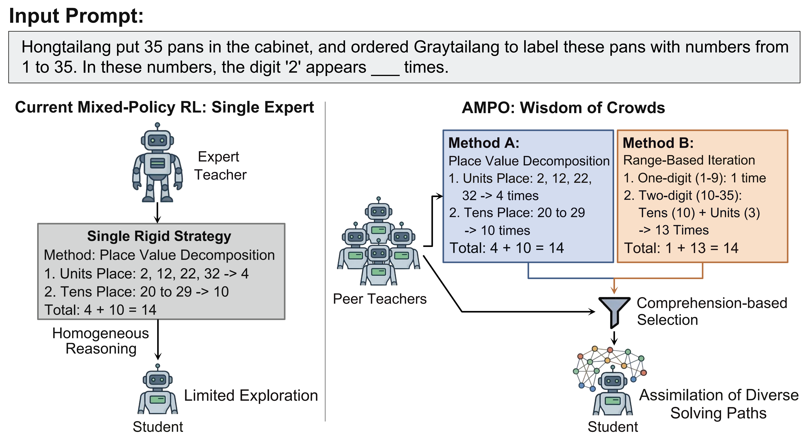
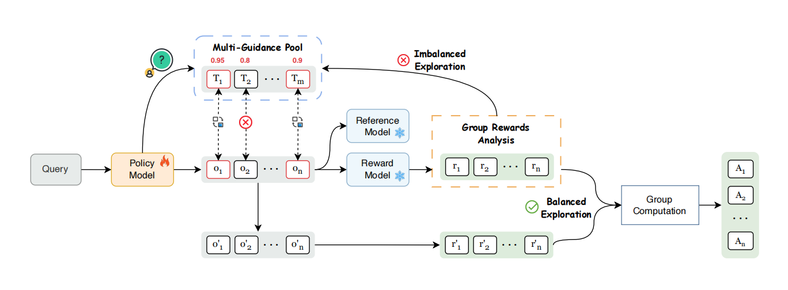

<div align="center">
<h1 align="center"> Many Small Teachers Beat One Giant: Adaptive Multi-Peer Policy Optimization for LLM Reasoning</h1>

<h5 align="center"> If you like our project, please give us a star ⭐ on GitHub for the latest update.</h5>

[](https://arxiv.org/abs/2510.02227) [](https://github.com/EnigmaYYYY/AMPO)   [](https://huggingface.co/SII-Enigma)
</div>



# ✨Getting Started

## Installation

You can install AMPO dependencies by running the following commands:
```bash
conda create -n ampo python=3.10
conda activate ampo
cd ampo
cd verl
# Make sure you have activated ampo conda env
# If you need to run with megatron
# bash scripts/install_vllm_sglang_mcore.sh
# Or if you simply need to run with FSDP
USE_MEGATRON=0 bash scripts/install_vllm_sglang_mcore.sh
cd ..
pip install -r requirements.txt
```

## Repo Structure

This repository includes:

- `ampo`: Codes for training AMPO, intelligently leverages guidance from multiple, diverse teacher models. Our main code changes are in ampo/verl/verl/adaptive_mix_src.
- `dataset`: Dataset for training and evaluating AMPO. 
- `examples`: Example script to train AMPO.
- `eval_scripts`: Evaluation scripts.

---

# Introduction

**AMPO (Adaptive Multi-Peer Policy Optimization)** is a novel Mixed-Policy RL framework that operationalizes the "Wisdom of Crowds" for Large Language Model (LLM) reasoning. While traditional Reinforcement Learning with Verifiable Rewards (RLVR) confines exploration to a model's inherent knowledge boundaries, and single-expert distillation risks enforcing a rigid reasoning style, AMPO adaptively harnesses diverse guidance from a pool of peer-sized (e.g., 7B) teacher models.

Our two core contributions, Adaptive Multi-Guidance Replacement and Comprehension-based Guidance Selection, ensure that this external knowledge is used both efficiently and effectively. AMPO establishes a highly efficient and scalable path for reasoning generalizability. 



### Key Highlights:
- **Many Small Teachers Beat One Giant:** We empirically demonstrate that guiding a student with a diverse committee of peer models strictly outperforms relying on a single massive expert (e.g., 671B DeepSeek-R1) under the same data budget.
- **Adaptive Multi-Guidance Replacement:** Rather than waiting for complete on-policy failure, AMPO dynamically intervenes when exploration becomes imbalanced. It adjusts the quantity of external guidance to maintain a roughly 1:1 contrastive ratio, maximizing gradient variance while preserving valuable self-discovery.
- **Comprehension-based Selection:** To ensure effective knowledge assimilation, this mechanism filters the multi-teacher pool to prioritize the reasoning paths most compatible with the student's current cognitive boundaries.
- **Superior Performance & Data Efficiency:** AMPO significantly outperforms standard GRPO (e.g., +5.4% on math and +11.1% on out-of-distribution tasks) and surpasses strong single-teacher baselines despite using nearly one-fifth of the training data.

### In-Distribution Performance
Comparison of mathematical reasoning capabilities across different methods.

| Method | AIME24/25 | AMC | MATH500 | Minerva | Olympiad | Avg. |
| :--- | :---: | :---: | :---: | :---: | :---: | :---: |
| Qwen2.5-1.5B-Ins | 2.8/1.3 | 21.9 | 51.4 | 19.1 | 19.1 | 19.3 |
| SFT | 0.8/0.2 | 13.6 | 35.6 | 7.0 | 12.0 | 11.8 |
| GRPO | 2.9/0.8 | 24.0 | 53.8 | 17.0 | 19.1 | <u>19.6</u> |
| SFT+GRPO | 1.8/0.3 | 24.5 | 52.8 | 11.0 | 19.3 | 18.4 |
| **AMPO** | 3.4/1.6 | 27.8 | 56.2 | 15.4 | 24.3 | **21.4** |
| | | | | | | |
| Llama3.2-8B-Ins | 2.8/0.4 | 20.2 | 45.4 | 19.1 | 14.5 | 17.1 |
| SFT | 1.8/0.8 | 18.6 | 46.6 | 20.6 | 17.9 | 17.7 |
| GRPO | 2.1/0.1 | 16.7 | 44.2 | 24.6 | 12.0 | 16.6 |
| SFT+GRPO | 4.2/0.2 | 19.4 | 51.0 | 22.4 | 20.1 | <u>19.6</u> |
| **AMPO** | 7.9/2.2 | 27.1 | 58.8 | 26.5 | 26.8 | **24.9** |
| | | | | | | |
| Qwen2.5-7B-Ins | 12.3/6.5 | 43.8 | 75.8 | 36.4 | 38.8 | 35.6 |
| SFT | 12.7/14.0 | 41.0 | 76.0 | 30.5 | 36.4 | 35.1 |
| GRPO | 11.3/9.9 | 46.6 | 76.8 | 34.6 | 37.6 | 36.1 |
| SFT+GRPO | 15.8/13.9 | 49.1 | 80.6 | 36.4 | 41.2 | 39.5 |
| LUFFY | 16.4/15.2 | 49.3 | 81.6 | 37.9 | 45.8 | 41.0 |
| **AMPO** | 17.4/17.7 | 50.5 | 80.2 | 39.0 | 44.7 | 41.6 |
| **SFT+AMPO(4L)** | 16.8/16.1 | 50.9 | 82.0 | 38.2 | 47.5 | <u>41.9</u> |
| **SFT+AMPO(4S)** | 17.5/15.5 | 52.1 | 83.4 | 36.8 | 48.4 | **42.3** |

<br>

### Out-of-Distribution Performance
Generalization capabilities across common-sense reasoning, expert-level science, diverse domain knowledge, and code generation tasks.

| Method | ARC-c | GPQA* | MMLU-Pro | HumanEval | Avg. |
| :--- | :---: | :---: | :---: | :---: | :---: |
| Qwen2.5-1.5B-Ins | 42.3 | 0.5 | 25.1 | 42.1 | 27.5 |
| SFT | 7.9 | 8.1 | 16.5 | 49.4 | 20.5 |
| GRPO | 68.7 | 21.7 | 34.1 | 48.8 | 43.3 |
| SFT+GRPO | 71.8 | 24.7 | 31.7 | 51.2 | **44.9** |
| **AMPO** | 72.4 | 25.8 | 33.4 | 44.3 | <u>44.0</u> |
| | | | | | |
| Llama3.2-8B-Ins | 44.3 | 0.0 | 40.2 | 59.8 | 36.1 |
| SFT | 83.2 | 20.2 | 39.6 | 56.7 | 50.0 |
| GRPO | 78.6 | 9.3 | 38.3 | 57.3 | 45.9 |
| SFT+GRPO | 86.1 | 31.3 | 47.0 | 63.4 | <u>57.0</u> |
| **AMPO** | 89.2 | 30.8 | 52.9 | 65.2 | **59.5** |
| | | | | | |
| Qwen2.5-7B-Ins | 85.1 | 6.6 | 55.8 | 80.5 | 57.0 |
| SFT | 80.0 | 17.2 | 45.2 | 83.0 | 56.3 |
| GRPO | 92.1 | 5.1 | 58.7 | 74.4 | 57.6 |
| SFT+GRPO | 90.8 | 34.3 | 57.3 | 81.7 | 66.0 |
| LUFFY | 92.0 | 21.7 | 60.3 | 78.1 | 63.0 |
| **AMPO** | 92.3 | 39.9 | 60.2 | 82.3 | **68.7** |
| **SFT+AMPO(4L)** | 89.7 | 33.3 | 56.3 | 80.5 | 65.0 |
| **SFT+AMPO(4S)** | 91.3 | 35.4 | 57.6 | 81.3 | <u>66.4</u> |

---

# Usage

## Data Preparation
You need to first run the data preparation script to get the training data in parquet format.
```bash
cd data
python prepare_train.py
```

## Model Preparation
You need to first download Qwen/Qwen2.5-7B-Instruct, Qwen/Qwen2.5-1.5B-Instruct, meta-llama/Meta-Llama-3-8B-Instruct. 

## Training
You can run the following command to train AMPO/GRPO for different base models:

```bash
  bash exp_scripts/train_ampo.sh
  bash exp_scripts/train_grpo.sh
```


## Evaluation
We provide scripts to evalute. You can evaluate using the following command:

```bash
bash eval_scripts/run_eval.sh # For common eval
bash eval_scripts/run_eval_pass_k.sh # For eval pss_at_k
bash eval_scripts/run_eval_humaneval.sh # We use evalscope to eval humaneval
```

## Inference

Here’s an example of using AMPO for inference:

<details>
<summary>Click to view inference example</summary>

```python
from transformers import AutoTokenizer
from vllm import LLM, SamplingParams

model_path="SII-Enigma/Qwen2.5-7B-Ins-AMPO"

question = "which number is larger? 9.11 or 9.9?"

tokenizer = AutoTokenizer.from_pretrained(model_path)
messages = [{"role": "user", "content": question}]
chat = tokenizer.apply_chat_template(messages, tokenize=False, add_generation_prompt=True)

llm = LLM(model=model_path)
params = SamplingParams(temperature=0.6, max_tokens=8192)
outputs = llm.generate([chat], params)
print(outputs[0].outputs[0].text)
```

</details>

## Models

| **Model** | **Base Models** |
|-----------|----------------|
| SII-Enigma/Qwen2.5-7B-Ins-AMPO  [Link](https://huggingface.co/SII-Enigma/Qwen2.5-7B-Ins-AMPO) | Qwen2.5-7B-Instruct  [Link](https://huggingface.co/Qwen/Qwen2.5-7B-Instruct) |
| SII-Enigma/Qwen2.5-1.5B-Ins-AMPO  [Link](https://huggingface.co/SII-Enigma/Qwen2.5-1.5B-Ins-AMPO) | Qwen2.5-1.5B-Instruct  [Link](https://huggingface.co/Qwen/Qwen2.5-7B-Instruct) |
| SII-Enigma/Llama3.2-8B-Ins-AMPO  [Link](https://huggingface.co/SII-Enigma/Llama3.2-8B-Ins-AMPO) | Llama-3.2-8B-Instruct  [Link](https://modelscope.cn/models/voidful/Llama-3.2-8B-Instruct) |

## Data

| **Data** |
|-----------|
| SII-Enigma/OpenR1-Math-R1-8.5k  [Link](https://huggingface.co/datasets/SII-Enigma/OpenR1-Math-R1-8.5k) |
| SII-Enigma/SFT-4LongCoTs-32k  [Link](https://huggingface.co/datasets/SII-Enigma/SFT-4LongCoTs-32k) |


# Acknowledgement

AMPO builds upon [LUFFY](https://github.com/ElliottYan/LUFFY), [veRL](https://github.com/volcengine/verl), [RLPR](https://github.com/OpenBMB/RLPR) and utilizes [vLLM](https://github.com/vllm-project/vllm) for inference. We utilize [Math-Verify](https://github.com/huggingface/Math-Verify) for math reasoning evaluation. We thank the open-source community for codes, datasets and backbones.

# Citation
If you find our model, data, or evaluation code useful, please kindly cite our paper:
```bib
@misc{yuan2025teacheradaptivemultiguidancepolicy,
      title={More Than One Teacher: Adaptive Multi-Guidance Policy Optimization for Diverse Exploration}, 
      author={Xiaoyang Yuan and Yujuan Ding and Yi Bin and Wenqi Shao and Jinyu Cai and Jingkuan Song and Yang Yang and Heng Tao Shen},
      year={2025},
      eprint={2510.02227},
      archivePrefix={arXiv},
      primaryClass={cs.CL},
      url={https://arxiv.org/abs/2510.02227}, 
}
```
